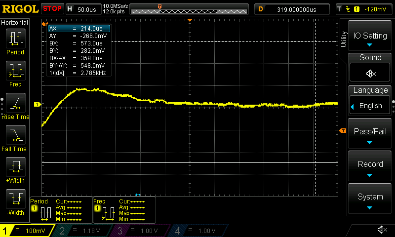
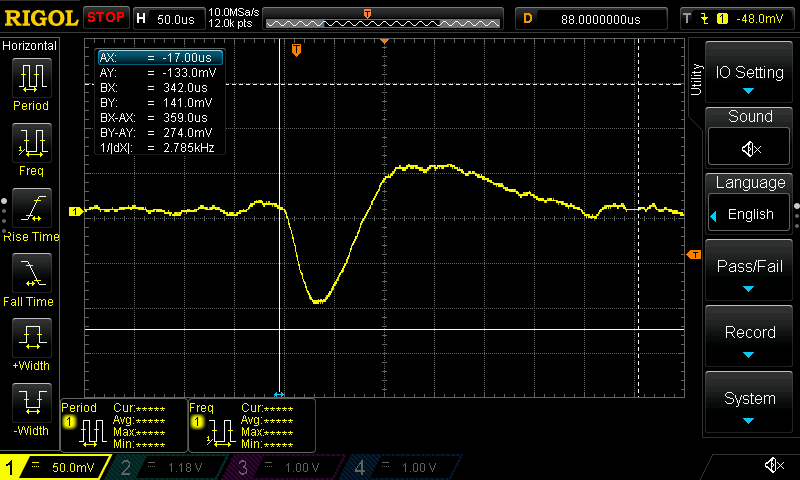

# Muon Detector

Two Python scripts for recording cosmic ray muon pulses from a Rigol DS1000Z series oscilloscope over USB using PyVISA.

The detector is a PIN diode array rather than a traditional scintillator and photomultiplier setup.

• `muon_event_logger.py`
Single channel logger. Arms the scope on a falling edge trigger, waits for a pulse, measures its amplitude and duration, and saves each event to a CSV along with a screenshot.

• `muon_coincidence_logger.py`
Two channel version. Both channels are captured from the same acquisition. If pulses are detected on both channels within a configurable time window, the event is marked as a coincidence. Screenshots are saved to either `coincidences/` or `singles/`.

## Detector

This setup uses a **PIN diode array**, not a scintillator and PMT.

PIN diodes are much less sensitive than PMTs and have a slower response. The pulses in the screenshots are therefore rounded and noisy rather than the sharp pulses you'd normally see from a PMT. Some triggers are also just noise or borderline events.

## Example captures





Both images are from the same run. The slow rise and fall comes from the PIN diode response.

## Requirements

Install the Python packages:

```text
pip install pyvisa numpy
```

You'll also need a Rigol scope connected over USB.

Set `VISA_ADDRESS` near the top of each script to match your scope. You can find the available VISA devices with:

```python
import pyvisa
print(pyvisa.ResourceManager().list_resources())
```

## Usage

Run the single channel logger:

```text
python muon_event_logger.py
```

Or the coincidence logger:

```text
python muon_coincidence_logger.py
```

Both scripts start capturing immediately and print each event as it is recorded.

To stop the logger, type `exit` and press Enter. This lets the script flush the CSV buffer and shut down normally instead of being terminated during a write.

Output is saved to a timestamped folder on `D:`. For example:

```text
D:\Muon Detector 2026-01-31 01-56-35\
```

The folder contains the event CSV and a `screenshots` folder containing a scope screenshot for each trigger.

If you don't use a `D:` drive, change the `base_folder` setting near the top of each script.

## How it works

Both scripts arm the scope using `:SINGLE` and then poll `:TRIG:STAT?` until it returns `STOP`. At that point, the scope has triggered and the waveform is available.

`DEAD_TIME_S` ignores triggers that happen too soon after the previous accepted event. This helps prevent ringing or other effects from being counted as multiple pulses.

The waveform is read using `:WAV:DATA?`. The raw ADC values are converted to volts using the scope's `:WAV:YINC?`, `:WAV:YREF?`, and `:WAV:YOR?` values.

Screenshots are requested using `:DISP:DATA? ON,PNG`. The response includes a SCPI binary block header, which the script removes before saving the data.

The coincidence logger uses channel 1 as the trigger. After the scope captures the waveform, it reads both channels from that acquisition and finds the center time of the pulse on each channel. If the two centers are within `COINCIDENCE_WINDOW_S`, the event is recorded as a coincidence. Otherwise the pulses are treated as singles.

## Notes and limitations

• **The screenshots are actually BMP files with a `.png` extension.** The scripts request `PNG` from the scope, but the returned data is currently being saved as raw BMP data without converting it. Rename the files to `.bmp` if an image viewer has trouble opening them.

• `duration_s` in the CSV isn't reliable yet and is `0.0` for many events. `find_pulse()` only records a duration if it finds both the start and end crossings within the captured waveform. If the pulse doesn't drop back below `HIGH_LEVEL_V` before the end of the trace, the duration ends up as `0.0`.

• Both scripts check `:TRIG:STAT?` every 2 ms while waiting for a trigger. This works, but it uses more CPU than an event or interrupt based approach would.

• `LOW_LEVEL_V`, `HIGH_LEVEL_V`, and `TRIGGER_LEVEL_V` were tuned for this particular PIN diode setup, including its noise floor and gain. Changing the detector or bias voltage will probably require adjusting these values manually.

• `COINCIDENCE_WINDOW_S` is set to 500 µs. That's much larger than the actual transit time between two closely spaced detectors. The large window is mainly there to account for the slow response of the PIN diodes rather than measuring an actual time of flight.
